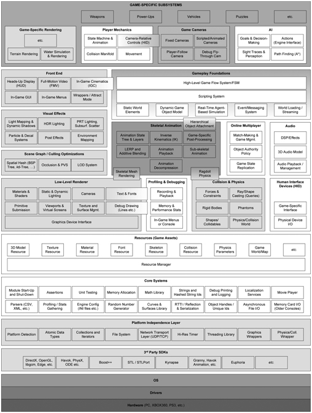
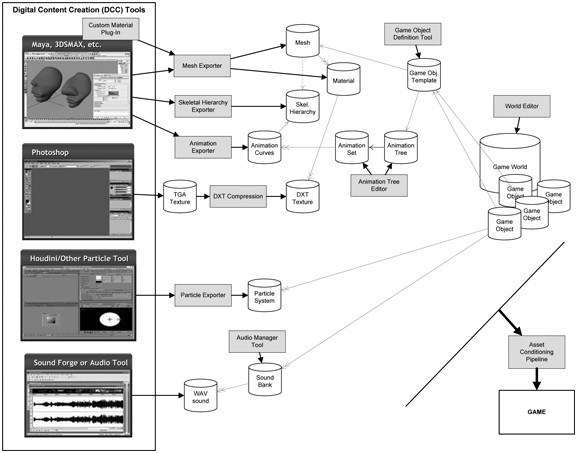

# Overview

## What are Games?
* Most 2D and 3D games are "soft real-time interactive agent-based computer simulations" (what a mouthful)
* Every real-time system has *deadlines*, which are actions that must take place at predetermined times, e.g. rendering the screen at 60 times a second to provide a smooth framerate
  * games are "soft" real-time systems because missing a deadline is not catastrophic
  * the control rod system in a nuclear power plant is a "hard" real-time system
* Games rely on mathematical models to simulate agents and interactions
  * models can be *analytical* — having an exact solution, or *numerical* — be an approximation of a solution
  * many models used in games are numerical because it's impossible to predict the player's actions

## Engine Architecture
* Game engines typically consist of a tool suite and a runtime component
* Built in layers of abstraction (like any software project)
  * effort is made to avoid circular dependencies (when a lower layer relies on a higher layer)

(skipping the obvious ones...)

### Platform Independence Layer
* most games need to run on multiple platforms
  * sits on top of the OS layer, shielding the rest of the engine from platform-specifics
  * wraps or replaces commonly used C library functions, OS calls, and platform APIs to ensure consistent behaviour across all hardware platforms (i.e. an abstraction over win32 and X11)

### Core Systems
* custom memory management, math libraries, and data structures & algorithms

### Resource Manager
* provides a unified interface to access all game assets

### Rendering Engine
* the largest/most complex part of a game engine

#### Low-Level Renderer
* raw rendering facilities with no regard to which portions of the rendered scene are visible
* collects *geometric primitives* or *render packets* (meshes, lines, particles, text strings etc.) and renders them as quickly as possible

#### Scene Graph/Culling Optimisations
* responsible for calculating and removing objects that the camera cannot see, before passing the job to the Low-Level Renderer
* for small games, a *frustrum cull* may be used (removing objects the camera can't see), but for larger worlds a *spatial subdivision* data structure might be used to calculate the potential visible set (PVS) of objects quickly
#### Front End
* overlaid 2D graphics like text, the HUD, in-game menus, full-motion video (full-screen cinematics), and in-game cinematics

### Profiling and Debugging Tools
* memory analysis, debug drawing, in-game console, dumping performance stats, recording and replaying game events
* e.g. the PS4 has a powerful core dump facility because it's continuously recording the last 15 seconds of gameplay

### Collision and Physics
* rigid-body dynamics

### Animation
* sprite/textures, rigid body hierarchy, skeletal, vertex, and morph target animation
* *skeletal animation* allows a 3D character mesh to be posed by an animator using a system of "bones", as the bones move, the vertices of the 3D mesh move with them
* the *skeletal mesh rendering* component is responsible for passing poses to the renderer as a set of matrices, which is used by the renderer to transform each vertex by the matrices in the set to produce the new position - known as *skinning*

### HIDs
* provies an abstraction layer on top of input devices
* allows customisation of game controls
* sometimes includes a system to detect chords of sequences of buttons

### Multiplayer/Networking
* support for multiplayer has profound impacts on how certain game engine components are designed; it is easier to add singleplayer functionality on a multiplayer game than vice versa
  * the Quake engine running in single player treats the executable as both the client and server

### Gameplay Foundation Systems

* *gameplay* - the actions, the rules and the world, the abilities of the characters and objects, and the goals and objectives of the player
  * typically implemented in the same language as the engine, or a high level scripting language

#### Game Worlds and Object Models
* worlds contain static and dynamic elements, usually modelled in an object-oriented manner
* the collection of object types is the *game object model*
* game objects include static background geometry, NPCs, weapons, vehicles, lights, and cameras
* intimately tied to a *software object model* - the set of language features, policies, and conventions used to implement OOP software (organising the static class hierarchy, polymorphism, referencing objects, identifying objects, simulating state over time etc.)

#### Event System
* handles communication between game objects
* events are created and queued, and passed to the receiving object by envoking its event handler

#### Scripting System
* allows rapid development of gameplay rules and content by removing the need to recompile the entire game after making changes

#### AI Foundations
* contains common "AI" functionality applicable to many games, such as path finding, identification of vulnerabilities, mesh generation, and object avoidance

## Tools and the Asset Pipeline

* Responsible for ingesting assets created from Digital Content Creation (DCC) tools and converting them into objects used by the game

### The Asset Conditioning Pipeline

* files produced by DCC apps are rarely suitable for ingestion directly into a game engine
  * they may be in proprietary formats, or contain information not required by the game
* data is exported from the DCC app into intermediate files and then further processed
  * intermediate files might be processed differently depending on the target platform
  
#### 3D Model/Mesh Data

* visible geometry in games is typically constructed from triangle meshes
* a mesh is a shape composed of triangles and vertices, with one or more *materials* applied to define surface properties
* created in 3D modelling programs and exported to a form digestable by the game engine (no standards exist, so teams often create custom file formats and exporters)

#### Skeletal Animation Data

* *skeletal meshes* are special meshes bound to a skeletal hierarchy to support articulated animation (sometimes called a *skin*)
  * each vertex indicates which joints in the skeleton it is bound to, and a set of joint weights specifying how much influence each joint has on the vertex
* animation data is highly memory-intensive (an unoptimised skeletal animation is defined by a stream of 4x3 matrix samples, taken at least 30 times a second) so is often stored in a highly compressed format

### The World Editor

* simplifies creation of the game world and different levels

### The Resource Database

* a database to manage the resources and associated metadata of all game assets
* might be implemented with a traditional relational database, or just a collection of text files under version control
